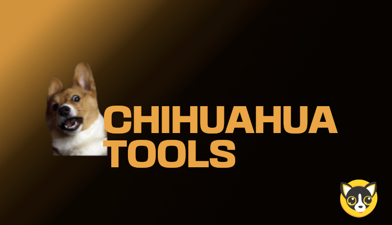

<!-- markdownlint-disable MD033 MD034 MD036 MD041 -->



# chihuahua-tools

- Mainnet website: https://chihuahua.tools
- Testnet website: https://test.chihuahua.tools

## Prerequisites

**Required**

- Git
- Node.js 14 or LTS
- Yarn
- Keplr Wallet browser extension

**Optional**

- S3 bucket instance (minio, etc.)

## Setup local development

```sh
# clone repository
git clone https://github.com/ChihuahuaChain/chihuahua-tools.git
cd chihuahua-tools

# install dependencies
yarn install

# copy env file and fill in values
cp .env.example .env

# run development server
yarn dev

# (optional) lint and format project
yarn lint
```

## References

- https://docs.chihuahua.tools
- https://docs.chihuahua.tools/docs/dashboards/airdrop/introduction
- https://docs.chihuahua.tools/docs/dashboards/airdrop/guide
- https://docs.chihuahua.tools/docs/dashboards/cw-1/subkeys/introduction
- https://docs.chihuahua.tools/docs/dashboards/cw-20/base/introduction
- https://docs.chihuahua.tools/docs/dashboards/cw-721/base/introduction

## Questions

- [Discord](https://discord.gg/Chihuahua)
- [Telegram](https://t.me/chihuahua_cosmos)
- [Twitter](https://twitter.com/ChihuahuaChain)


